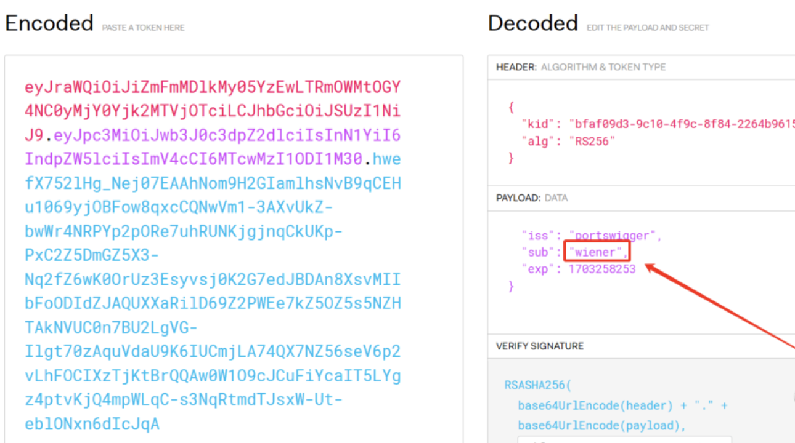

# 什么是JTW

JWT 全称 JSON Web Token，是一种标准化格式，用于在系统之间发送加密签名的 JSON 数据。

JWT的结构由三部分组成，第一部分是Header，第二部分是Payload，第三部分是Signature，它们之间由三个 `.` 分隔，JWT 中的每一部分都是经过Base64编码的，并不是加密的，因此JWT中的信息是可以被解密的。

Header 部分存储的是 Token 类型和加密算法，包含两个字段：alg和typ
- alg(algorithm)：指定了使用的加密算法，常见的有HMAC、RSA和ECDSA等算法
- typ(type)：指定了JWT的类型，通常为JWT

Payload 包含了JWT的主要信息，包含三个类型的字段：注册声明、公共声明和私有声明
- 公共声明：是自定义的字段，用于传递非敏感信息，例如:用户ID、角色等
- 私有声明：是自定义的字段，用于传递敏感信息，例如密码、信用卡号等
- 注册声明：预定义的标准字段，包含了一些JWT的元数据信息，例如:发行者、过期时间等

Signature 是使用指定算法对Header和Payload进行签名生成的，用于验证JWT的完整性和真实性  
- Signature的生成方式通常是将Header和Payload连接起来然后使用指定算法对其进行签名，最终将签名结果与Header和Payload一起组成JWT
- Signature的生成和验证需要使用相同的密钥

# JWT工作流程
1. 用户在客户端登录并将登录信息发送给服务器
2. 服务器使用私钥对用户信息进行加密生成JWT并将其发送给客户端
3. 客户端将JWT存储在本地，每次向服务器发送请求时携带JWT进行认证
4. 服务器使用公钥对JWT进行解密和验证，根据JWT中的信息进行身份验证和授权
5. 服务器处理请求并返回响应，客户端根据响应进行相应的操作

# JWT数据特征
JWT数据为：`eyJhb`开头，前面也可能还有关键词：`Bearer`

# 渗透方法

## 签名未校验
解码后直接修改Payload中的数据，编码后替换原数据进行发送  

## 加密算法未进行强验证
解码后***把header中的alg参数的值改为none***  
在JWT的Header中alg的值用于告诉服务器使用哪种算法对令牌进行签名，如果"alg"字段设为"None"，则标识不签名，这样一来任何token都是有效的，设定该功能的最初目的是为了方便调试，但是若不在生产环境中关闭该功能，攻击者可以通过将alg字段设置为"None"来伪造他们想要的任何token，接着便可以使用伪造的token冒充任意用户登陆网站。  

## 弱密钥
使用`jwt_tool`爆破工具对jwt进行爆破`python3 jwt_tool.py [jwt数据] -C -d jwtkey.txt` ，爆破出密钥后对jwt数据进行窜改

# 相关工具
1. 解码： https://jwt.io/
2. JWT密钥字典：https://github.com/wallarm/jwt-secrets
3. JWT密钥爆破：https://github.com/ticarpi/jwt_tool
4. jwt会声明使用的什么hash算法，试试把hash那一块改成空