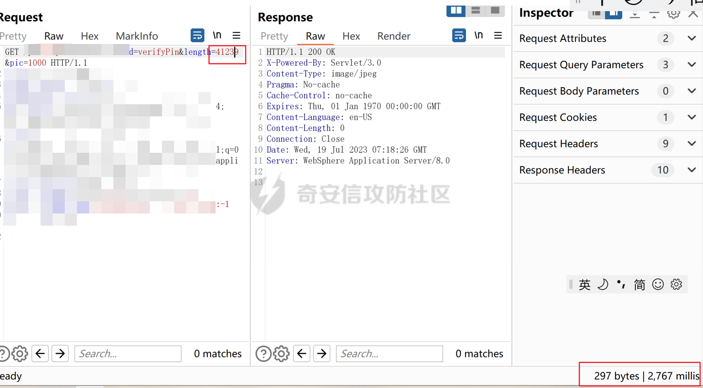
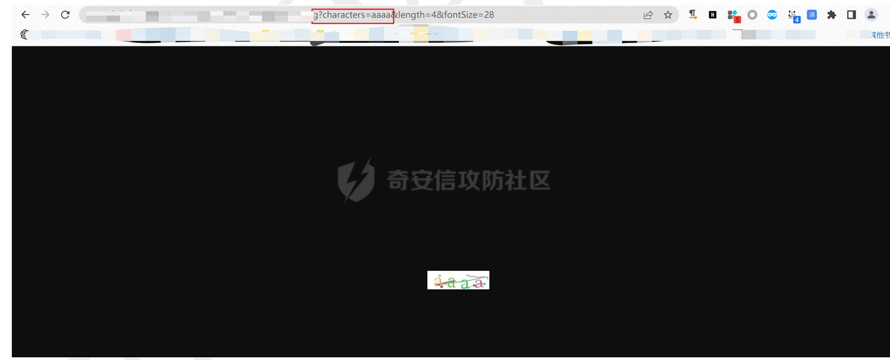
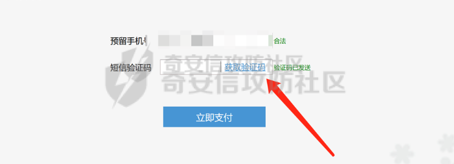
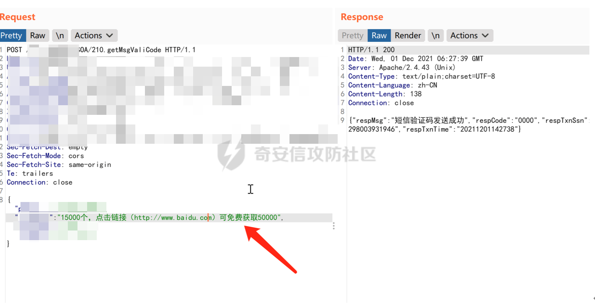
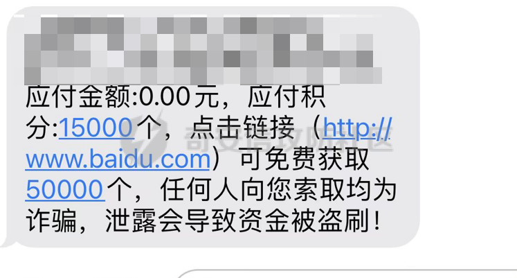

# 图形验证码

## 图形验证码长度可控

简单测试方法，就是看到一个登录框，然后新建打开图片链接，在图片链接中就有机会看到两个参数值，一个是 width，一个是 length。这两个参数是计算图片验证码的长宽，如果长宽过高就会过度消耗的是服务器的 CPU 资源，造成DDos。

当length为比较大的时候，响应时间为2767millis

## 图形验证码可绕过

验证码设置为null、空、true、0000、8888等时就会通过。一般为测试环境为了方便测试，正式忘记删除这个逻辑。

## 图形验证码未失效

图形验证码没有对应的失效机制，导致图形验证码能被多次利用。图形验证码在使用后未失效，发送短信时抓包，发送到Repeter中进行重放，可以发送成功!

## 图形验证码随机值可控

生成验证码的随机值被写在了 url 里面。

将characters固定为aaaa，可以看到图形验证码为aaaa

## 图形验证码返回到前端

响应包中返回了本次或下次图形验证码的内容。

# 短信验证码

## 短信轰炸

短信轰炸除了给同一个手机重复发送外，还可以是对不同的手机号进行发送。

### 发送频次限制绕过

1. 删除cookie尝试发送  
2. 在手机号前后面加值或特殊符号：

- 加空格
- 86，086，0086，+86，0，00
- /r，/n，！，#等等随便其他特殊符号  

3. 删除cookie
4. 在请求包中添加XFF头
5. 在手机号后持续加逗号，加一个,两个,以此类推增加尝试（18888888888,,,,,,）
6. 手机号进行url编码了，如：%317699999999，%31%37699999999
7. 多写几位数，12位手机号只取前11位漏洞，如输入138888888889，只截取前11位号码
8. 添加多个值： Mobile=18888888888,17777777777
9. 添加多个参数：Mobile=17777777777&Mobile=18888888888
10. 修改返回包Flase 为 Success
11. 并发

## 短信验证码可爆破

如果服务器没有限制提交的验证码的次数，可以爆破这个验证码。一般4位数字的验证码容易爆破且爆破成功是高危漏洞。

## 短信验证码可编辑

短信内容可控制编辑

## 响应包包含短信验证码

在抓取短信验证码的数据包后，在 response 可以看到短信验证码

