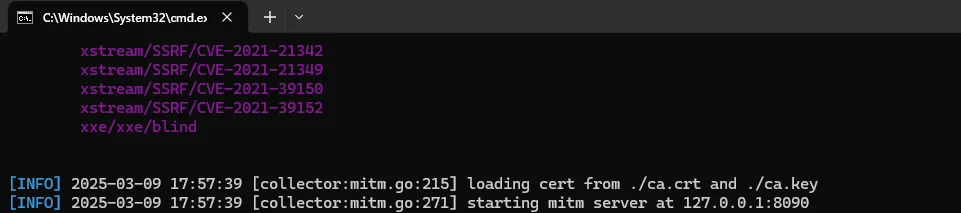
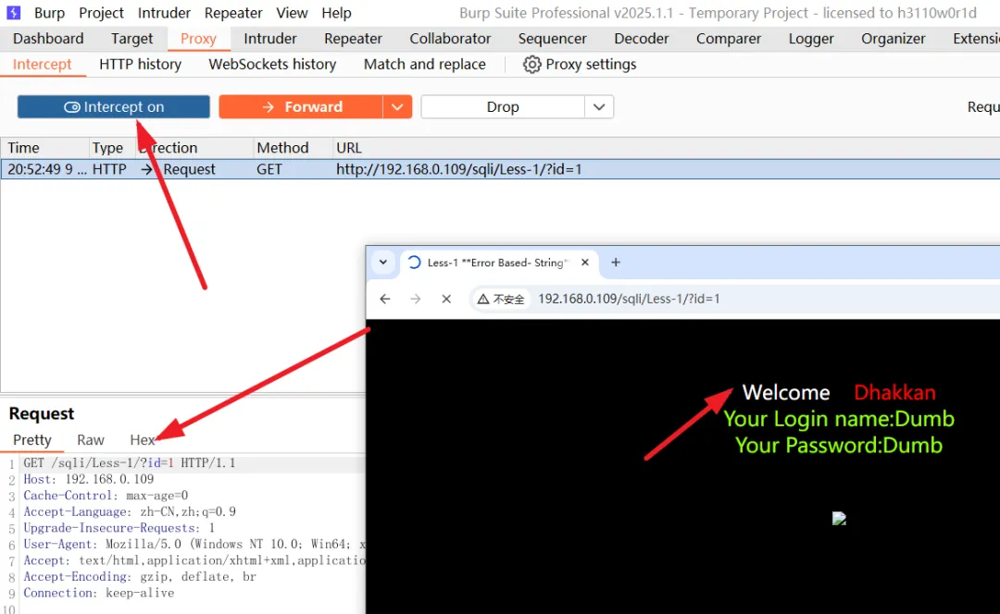
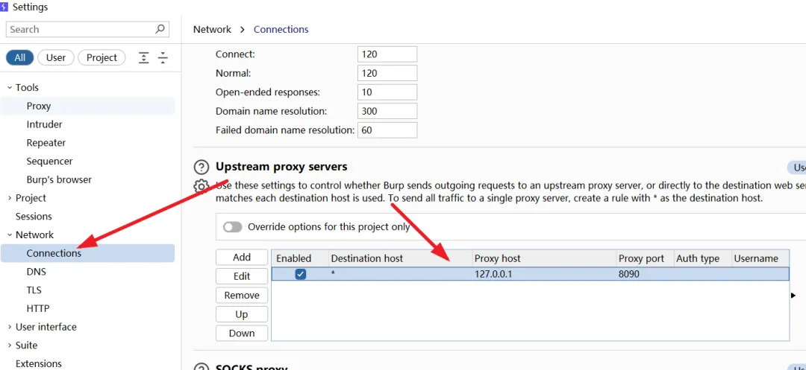
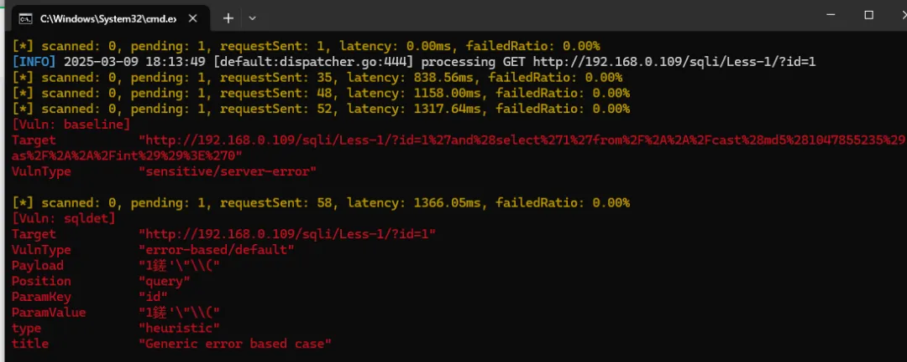
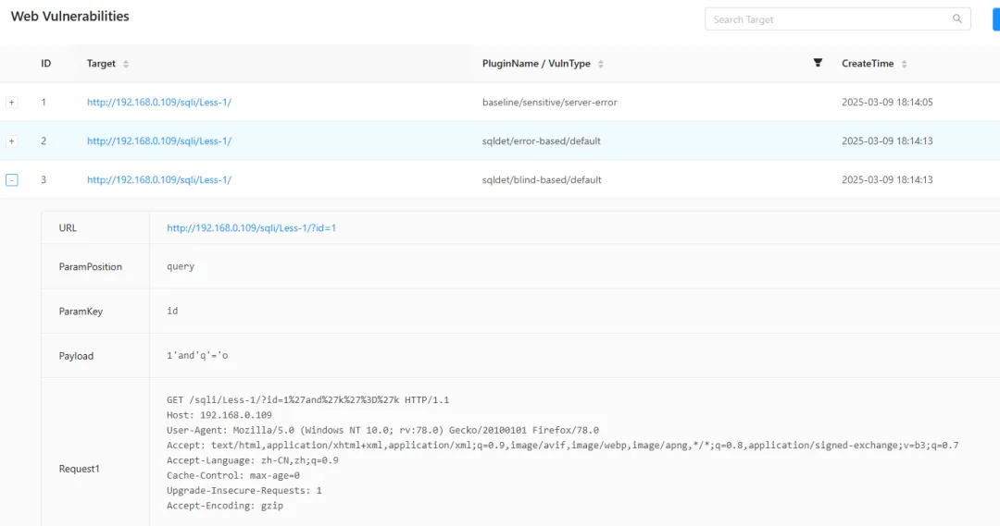

# 一、首先运行Xray，进入监听状态
`xray_windows_amd64.exe webscan --listen 127.0.0.1:8090 --htmle-output listen.htm`

# 二、打开BurpSuite，保证能正常抓包

# 三、设置上游代理，也就是xray监听的代理地址

# 四、重新刷新一下可能存在sql注入的页面，burpsuite会自动将该地址转发到xray上，进行漏洞测试

# 五、测试结果会自动保存到本地
