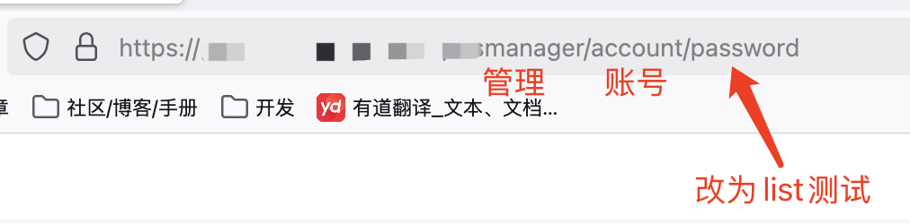

# url中出现一些关键字可以进行替换尝试
save、read、view、open

# 请求体中含有参数的值是url
1. 在请求中的参数值url末尾添加路径，例如`/test`，进行测试查看返回值是否携带修改后的路径。
2. 如果修改请求中的参数值，在响应中有影响，修改请求中的整个url值，修改为指定的地址测试。
3. 修改url响应如果400或其他报错，尝试通过特殊符号进行截断，例如`http://a.com?xxxx``http://a.com#xxx``http://a.com%20xx`

# 关注重要功能点
在一些重要功能点，例如账号管理功能，修url查看是否存在越权，例如：list(列表)

# 加密和sign
加密方式js搜索关键字：`AES、BEGIN PUBLIC KEY、encrypt、enc、iv:`

签名方式js搜索关键字：`md5、.sign、"sign"`，找不到的话在请求过程中打断点调试定位sign位置，一般api都会使用md5作为sign

  

