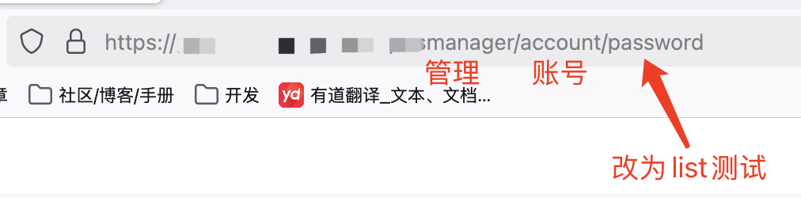

## url中出现一些关键字可以进行替换尝试
save、read、view、open

## 请求体中含有参数的值是url
1. 在请求中的参数值url末尾添加路径，例如`/test`，进行测试查看返回值是否携带修改后的路径。
2. 如果修改请求中的参数值，在响应中有影响，修改请求中的整个url值，修改为指定的地址测试。
3. 修改url响应如果400或其他报错，尝试通过特殊符号进行截断，例如`http://a.com?xxxx``http://a.com#xxx``http://a.com%20xx`

## 重要功能点
在一些重要功能点，例如账号管理功能，修url查看是否存在越权，例如：list(列表)


## Windows信息带出（dnslog）
- %CD%				当前目录  
- %COMPUTERNAMW%	计算机名称  
- %USERNAME%		当前登陆用户名  

## 内容编码降级攻击
`Accept-Encoding: gzip;q=0, deflate;q=0`
原理：强制服务端返回未压缩明文
防御：禁用不安全的编码方式

## 协议走私攻击向量
```http
GET / HTTP/1.1
Transfer-Encoding: chunked

0

GET /admin HTTP/1.1
```
防御：配置中间件拒绝歧义请求

## Null字节注入
在尝试使用特殊字符注入的时候，可以尝试Null字节。例如URL编码`%00`，转义字符`\0`
在JSON请求中，不能直接使用常规的URL编码等，可以用\u序列插入Uonicode字符，即`\u0000`，表示Null字节字符。