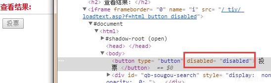
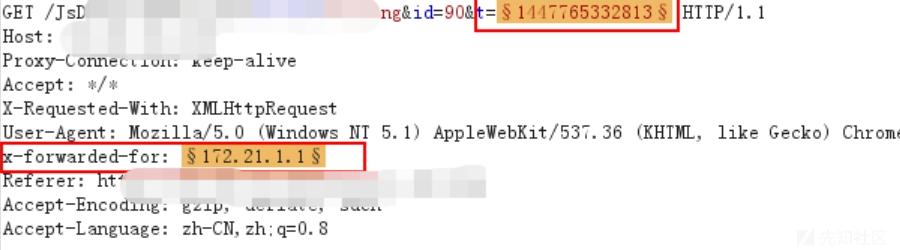
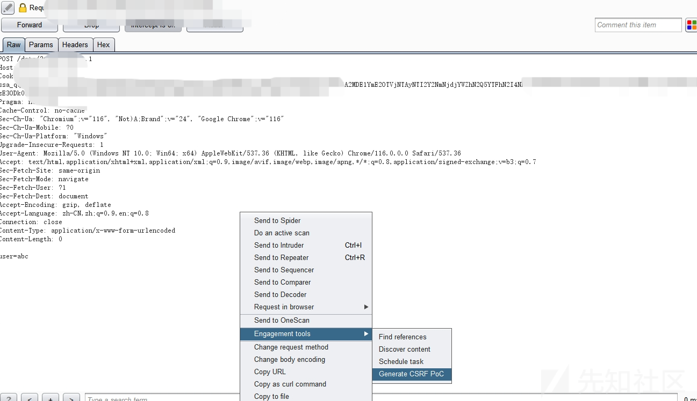
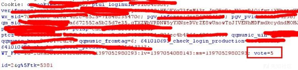
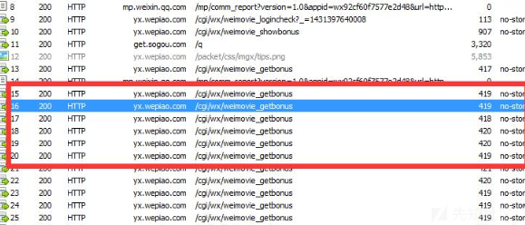
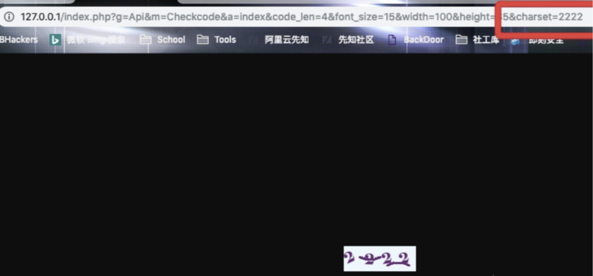
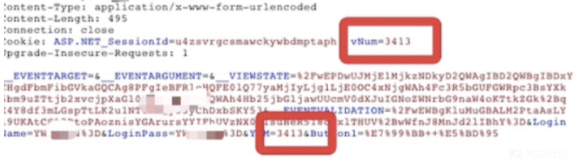
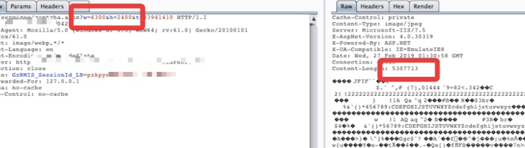
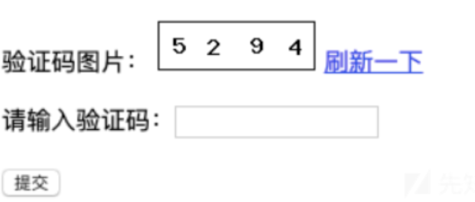

投票功能漏洞利用进行刷票

# 一、无任验证措施

执行python脚本循环调用投票接口

```python
import requests
url='http://www.domain.com/comment.php?aid=123&who=1&t=1385710179528'
while 1:
    requests.get(url)
```

# 二、仅客户端校验

一切来自客户端的数据都是不可信的，因为这些数据全部都是在前端

1. 弹框提示，仅仅是弹框，并没有阻断后面代码执行，刷新页面继续投票，票数照常增加

   

2. 排除第一种情况，换个浏览器即可重新投票，或者清理下缓存即可重新投票

3. 有时候你可能也会碰到投票后按钮变为灰色，只需删除前端控制代码即可，或者直接往服务端进行发包，因为是客户端限制

   

# 三、User-Agent验证

有的会用user-agent进行验证，毕竟打开页面，他也许就判断你的浏览器，觉得你只经常用这个浏览器，修改user-agent即可绕过

(使用User-Agent字典进行遍历)

# 四、Cookie验证

有时候会用绑定cookie来进行验证，一个cookie为一个用户，修改cookie即可绕过限制，有时候并不一定需要用户的cookie，可以随意修改两个字符尝试，也许会有意想不到的效果

# 五、IP验证

有时候系统会根据ip来进行判断，一个ip投票一次，可尝试修改`X-Forwarded-For，Clien-IP`，可进行绕过



排除上面情况，还是使用真实ip进行验证，可使用ip代理池进行绕过

（tips:路由器每次重启ip不一样，手机开飞行模式也一样，代理ip也可以）

使用代理池发送请求py脚本：

```python
import requests
from random import choice

# 代理池列表
proxy_list = ['http://ip1:port1', 'http://ip2:port2', 'http://ip3:port3']

# 随机选择一个代理
proxy = choice(proxy_list)

# 构造请求头
headers = {
    'User-Agent': 'Mozilla/5.0 (Windows NT 10.0; Win64; x64) AppleWebKit/537.36 (KHTML, like Gecko) Chrome/58.0.3029.110 Safari/537.3'}

# 发送请求
try:
    response = requests.get('http://www.example.com', headers=headers, proxies={'http': proxy})
    print(response.text)
except:
    print('请求失败')
```

# 六、当投票量大于阅读量时就是刷票行为

测试刷票漏洞时可以观察下阅读量，如果票数大于阅读量肯定就是刷票，假设根据前面的姿势刷票投到了第二，但某产商说我们统计结果会有人工判断，如果发现会进行漏洞降级，此时需要你的投票数量一定要符合阅读范围之内，如果绕过了限制进行刷票时，持续了一段时间失败了，请看浏览量，也许在此处做了判断


# 七、组合拳1：Csrf刷票

Csrf简介：攻击者利用用户已经登录的身份，在用户不知情的情况下向服务器发送恶意请求，从而实现攻击目的。攻击者通常会在第三方网站上植入恶意代码，当用户访问该网站时，代码就会自动向目标网站发送伪造的请求，从而欺骗服务器执行非法操作

Burp的Engagement tools功能可直接生成CSRF_PoC



# 八、组合拳2：Xss打Cookie刷票

如果站点存在xss，储存Xss就不用说了，配合Csrf直接自动化刷票了，即使是反射Xss也可以进行利用，比如"看这个人的票数好高，大家看看他是不是刷票:http://domain.com" 同时网址缩短后做上跳转收集用户的Cookie，接着遍历Cookie批量发包即可实现刷票，如有Csrf也可以利用Csrf实现自动化刷票，相对没有储存Xss利用方便

# 九、观察数据包请求（验证参数等等）

有的候系统在点击投票时会生成一个验证值，可能在Get，Post，Cookie，修改他们给的判断值即可实现刷票



# 十、并发线程（条件竞争）

利用前面方法我们无法进行刷票了，都被限制了，这时我们可以利用并发线程，简单来说就是让服务器处理跟不上请求速度，线程还没有达到需要验证的地方已经发出去了很多请求，用Fiddler批量发包，导致服务器没有跟上处理，导致刷票，出现问题的几率比较高



# 十一、验证码绕过

## （一）验证码使用后不会销毁

验证码可重复使用，不提示验证码错误

## （二）生成验证码字符集可控

验证码可控，可自行选择验证码



## （三）、验证码存放在暴露位置



## （四）、验证码为空，或8888，0000可绕过

验证码为空，是因为程序逻辑错误，验证码验证一次之后本该退出此次验证码，生成新的，由于没有生成新的继续验证密码是否正确，8888,0000等为开发程序时设置的万能密码，方便测试，有时候会忘记删除

例如：`1111,2222,3333,4444`等等

## （五）、验证码尺寸可控

我们的主题是绕过验证码去投票，那么可以尺寸改为很小，仅有一个数字或者字母，这样很好去识别，从而进行绕过刷票

点缀一下其他的知识：如1.png?width=100      修改width控制大小，首先可造成Ddos
该问题被人们广为关注源于PHPcms早期版本的后台登录验证码尺寸可控,可用于DDoS



##  （六）、验证码过于简单，可用于插件识别

验证码过于简单,可轻易机器识别，同样可实现绕过刷票



## （七）、会话绕过

当投票前几次没有验证码，而后又出现了验证码可能是因为一个会话的尝试次数比较多，可以尝试修改会话，直接清空缓存或打开隐私窗口

# 十二、手机验证码投票

用在线接码平台

